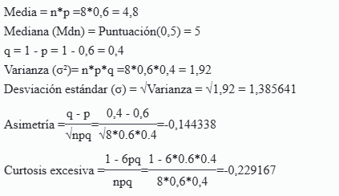

# DISTRIBUCION BINOMIAL

# n = 8 alumnos, p = 0.60 (asisten el viernes)


n \<- 8 p \<- 0.60



# --- Inciso a) P(X \>= 7) ---

```{r}
p_x7 <- dbinom(7, size = n, prob = p)
p_x8 <- dbinom(8, size = n, prob = p)
p_a  <- p_x7 + p_x8

cat("P(X = 7) =", round(p_x7, 4), "\n")
cat("P(X = 8) =", round(p_x8, 4), "\n")
cat("P(X >= 7) =", round(p_a, 4), "\n")

p_a2 <- pbinom(6, size = n, prob = p, lower.tail = FALSE)
cat("Verificacion pbinom:", round(p_a2, 4), "\n")
```

# --- Inciso b) P(Y \>= 2) ---

```{r}
q <- 1 - p
p_y0 <- dbinom(0, size = n, prob = q)
p_y1 <- dbinom(1, size = n, prob = q)
p_b  <- 1 - (p_y0 + p_y1)

cat("P(Y = 0) =", round(p_y0, 4), "\n")
cat("P(Y = 1) =", round(p_y1, 4), "\n")
cat("P(Y >= 2) =", round(p_b, 4), "\n")

p_b2 <- pbinom(1, size = n, prob = q, lower.tail = FALSE)
cat("Verificacion pbinom:", round(p_b2, 4), "\n")
```

# --- Grafica ---

x \<- 0:n prob_x \<- dbinom(x, size = n, prob = p)

```{r}

barplot(prob_x,
        names.arg = x,
        col = ifelse(x >= 7, "#1D9E75", "#B4B2A9"),
        main = "Distribucion Binomial (n=8, p=0.60)",
        xlab = "Numero de alumnos que asisten",
        ylab = "Probabilidad",
        ylim = c(0, 0.32),
        border = NA)
```

**a)** La probabilidad de que **al menos 7 alumnos** asistan a clases el viernes es aproximadamente **0,1064 (10,64%)**, resultado obtenido sumando P(X = 7) y P(X = 8). Esto indica que, aunque la mayoría de alumnos tiende a asistir, es poco probable que casi todos lo hagan simultáneamente en un grupo de 8.

**b)** La probabilidad de que **al menos 2 alumnos no asistan** es aproximadamente **0,6846 (68,46%)**, lo que refleja que es bastante frecuente que dos o más estudiantes se ausenten un viernes, considerando que el 40% de la población no asiste regularmente.
