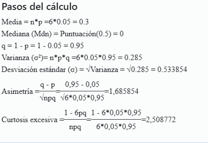

```{=html}
<div style="position: absolute; top: 80px; right: 40px;">
  
</div>
```

# **ejercicio 1.**

Se sabe que el 60% de los alumnos de una universidad asisten a clases el viernes. En una encuesta a 8 alumnos de la universidad. ¿Cuál es la probabilidad de que a) por lo menos siete asistan a clase el viernes? b) por lo menos dos no asistan a clase.

Este ejercicio se resuelve con una **Distribución Binomial**:

n \<- 8 p \<- 0.60


#-Inciso a) P(X \>= 7)

```{r}
p_x7 <- dbinom(7, size = n, prob = p)
p_x8 <- dbinom(8, size = n, prob = p)
p_a  <- p_x7 + p_x8

cat("P(X = 7) =", round(p_x7, 4), "\n")
cat("P(X = 8) =", round(p_x8, 4), "\n")
cat("P(X >= 7) =", round(p_a, 4), "\n")

p_a2 <- pbinom(6, size = n, prob = p, lower.tail = FALSE)
cat("Verificacion pbinom:", round(p_a2, 4), "\n")
```

#-Inciso b) P(Y \>= 2)

```{r}
q <- 1 - p
p_y0 <- dbinom(0, size = n, prob = q)
p_y1 <- dbinom(1, size = n, prob = q)
p_b  <- 1 - (p_y0 + p_y1)

cat("P(Y = 0) =", round(p_y0, 4), "\n")
cat("P(Y = 1) =", round(p_y1, 4), "\n")
cat("P(Y >= 2) =", round(p_b, 4), "\n")

p_b2 <- pbinom(1, size = n, prob = q, lower.tail = FALSE)
cat("Verificacion pbinom:", round(p_b2, 4), "\n")
```

# -Grafica

x \<- 0:n prob_x \<- dbinom(x, size = n, prob = p)

```{r}

barplot(prob_x,
        names.arg = x,
        col = ifelse(x >= 7, "#1D9E75", "#B4B2A9"),
        main = "Distribucion Binomial (n=8, p=0.60)",
        xlab = "Numero de alumnos que asisten",
        ylab = "Probabilidad",
        ylim = c(0, 0.32),
        border = NA)
```

# **ejercicio 2.**

Según los registros universitarios fracasa el 5% de los alumnos de cierto curso. ¿cuál es la probabilidad de que, de 6 estudiantes seleccionados al azar, menos de 3 hayan fracasado?

**Identificación de variables**

- n = 6 (estudiantes seleccionados)

- p = 0,05 (probabilidad de fracaso)

- X = número de alumnos que fracasan

- Se busca: **P(X \< 3) = P(X = 0) + P(X = 1) + P(X = 2)**

n \<- 6 p \<- 0.05



# -Probabilidades individuales

```{r}
p_x0 <- dbinom(0, size = n, prob = p)
p_x1 <- dbinom(1, size = n, prob = p)
p_x2 <- dbinom(2, size = n, prob = p)
p_menor3 <- p_x0 + p_x1 + p_x2

cat("P(X = 0) =", round(p_x0, 4), "\n")
cat("P(X = 1) =", round(p_x1, 4), "\n")
cat("P(X = 2) =", round(p_x2, 4), "\n")
cat("P(X < 3) =", round(p_menor3, 4), "\n")
p_ver <- pbinom(2, size = n, prob = p)
cat("Verificacion pbinom:", round(p_ver, 4), "\n")

```
#-Medidas descriptivas:
```{r}
media    <- n * p
varianza <- n * p * (1 - p)
desv_est <- sqrt(varianza)
asimetria   <- (1 - 2*p) / sqrt(n*p*(1-p))
curtosis    <- (1 - 6*p*(1-p)) / (n*p*(1-p))

cat("Media:", round(media, 4), "\n")
cat("Varianza:", round(varianza, 4), "\n")
cat("Desviacion estandar:", round(desv_est, 4), "\n")
cat("Asimetria:", round(asimetria, 4), "\n")
cat("Curtosis excesiva:", round(curtosis, 4), "\n")
```

# -Grafica

```{r}
x <- 0:n
prob_x <- dbinom(x, size = n, prob = p)

barplot(prob_x,
        names.arg = x,
        col = ifelse(x < 3, "#1D9E75", "#B4B2A9"),
        main = "Distribucion Binomial (n=6, p=0.05)",
        xlab = "Numero de alumnos que fracasan",
        ylab = "Probabilidad",
        ylim = c(0, max(prob_x) + 0.05),
        border = NA)
```

Con base en el modelo de distribución binomial aplicado (n = 6, p = 0,05), se puede concluir lo siguiente: P(X \< 3): La probabilidad de que menos de 3 estudiantes hayan fracasado es aproximadamente 0,9978 (99,78%), lo que indica que es casi seguro que en un grupo de 6 alumnos seleccionados al azar, a lo sumo 2 hayan reprobado el curso. Este resultado es coherente con la baja tasa de fracaso del 5%, lo que significa que la gran mayoría de los estudiantes aprueba el curso. La distribución está fuertemente sesgada hacia la derecha, con una media de apenas 0,30 alumnos esperados en fracaso por grupo, y una asimetría positiva que confirma que los valores altos de fracaso son extremadamente poco frecuentes. En conclusión, el modelo binomial demuestra que, dada la baja probabilidad de fracaso, es prácticamente seguro observar menos de 3 reprobados en muestras pequeñas de 6 estudiantes.

# **ejercicio 3.**

En promedio, el 10% de las varillas de madera usadas en cierto producto presentan problemas para ser usadas. ¿cuál es la probabilidad de que en un paquete de 15 varillas, a) encuentre exactamente 5 con defectos. b) por lo menos 10 estén nudosas, c) no más de 4 estén nudosas.

Identificación de variables

n = 15 (varillas en el paquete)
p = 0,10 (probabilidad de defecto)
X = número de varillas con defectos
Se busca:

a) P(X = 5)
b) P(X ≥ 10)
c) P(X ≤ 4)

```{r}
n <- 15
p <- 0.10

# a) Exactamente 5 con defectos
p_x5 <- dbinom(5, size = n, prob = p)
cat("a) P(X = 5) =", round(p_x5, 4), "\n")

# b) Por lo menos 10 nudosas
p_x10 <- pbinom(9, size = n, prob = p, lower.tail = FALSE)
cat("b) P(X >= 10) =", round(p_x10, 4), "\n")

# c) No mas de 4 nudosas
p_x4 <- pbinom(4, size = n, prob = p)
cat("c) P(X <= 4) =", round(p_x4, 4), "\n")
```


```{r}
media      <- n * p
varianza   <- n * p * (1 - p)
desv_est   <- sqrt(varianza)
asimetria  <- (1 - 2*p) / sqrt(n*p*(1-p))
curtosis   <- (1 - 6*p*(1-p)) / (n*p*(1-p))

cat("Media:", round(media, 4), "\n")
cat("Varianza:", round(varianza, 4), "\n")
cat("Desviacion estandar:", round(desv_est, 4), "\n")
cat("Asimetria:", round(asimetria, 4), "\n")
cat("Curtosis excesiva:", round(curtosis, 4), "\n")
```
```{r}
x <- 0:n
prob_x <- dbinom(x, size = n, prob = p)

barplot(prob_x,
        names.arg = x,
        col = ifelse(x == 5, "#E74C3C",
              ifelse(x >= 10, "#1D9E75",
              ifelse(x <= 4, "#3498DB", "#B4B2A9"))),
        main = "Distribucion Binomial (n=15, p=0.10)",
        xlab = "Numero de varillas con defectos",
        ylab = "Probabilidad",
        ylim = c(0, max(prob_x) + 0.05),
        border = NA)

legend("topright",
       legend = c("P(X = 5)", "P(X >= 10)", "P(X <= 4)"),
       fill = c("#E74C3C", "#1D9E75", "#3498DB"),
       border = NA,
       bty = "n")
```


